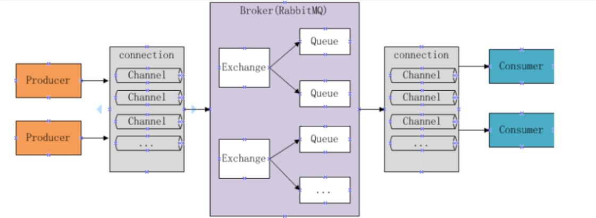
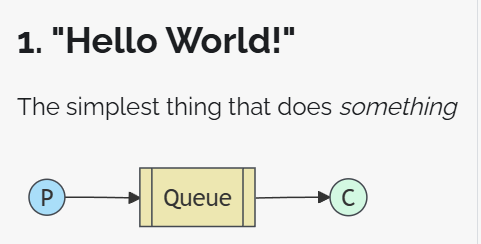
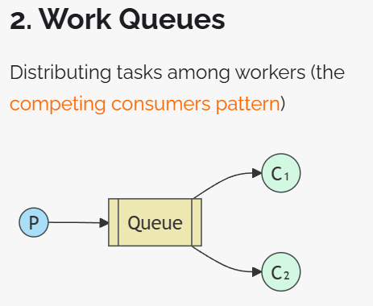
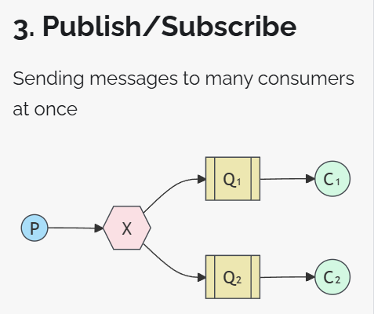
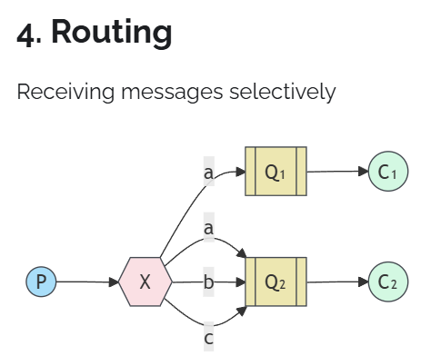
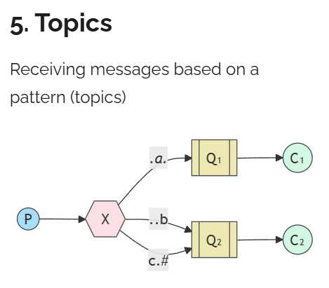
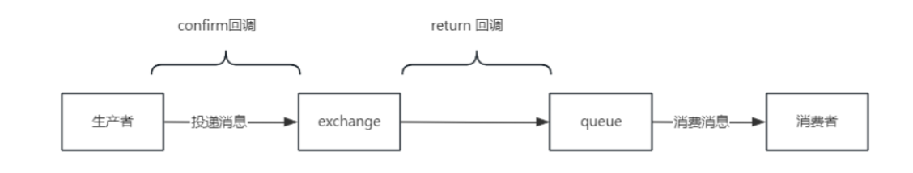
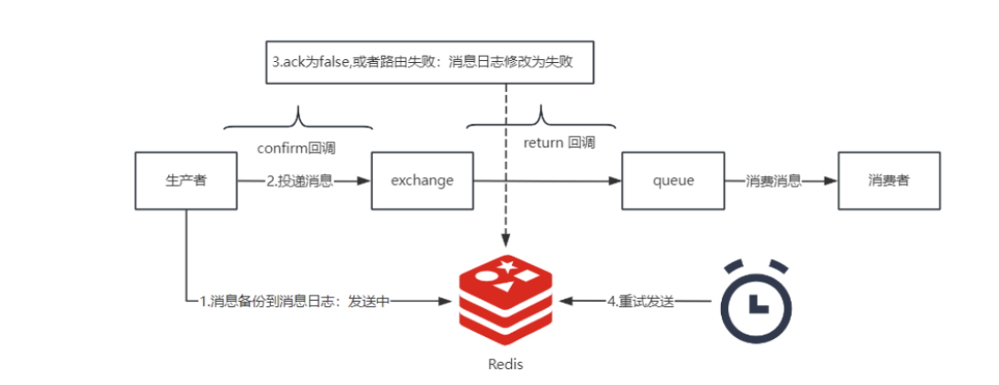
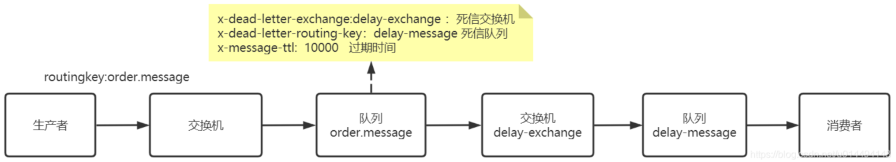
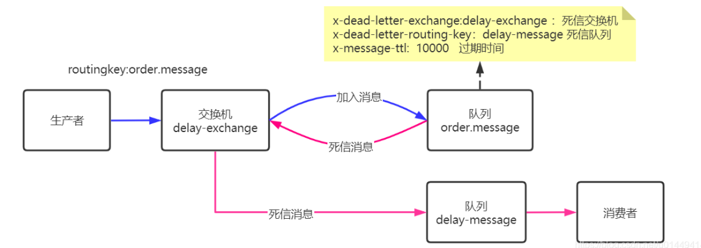

# RabbitMQ

## RabbitMQ入门

### RabbitMQ是什么?

MQ全称为Message Queue，即消息队列. 它也是一个队列,遵循FIFO原则 。RabbitMQ是由erlang语言开发，基于AMQP（Advanced Message Queue Protocol高级消息队列协议）协议实现的消息队列，它是一种应用程序之间的通信方法，消息队列在分布式系统开 发中应用非常广泛。官方地址: [RabbitMQ](http://www.rabbitmq.com/) 

### RabbitMQ的使用场景

开发中消息队列通常有如下应用场景： 消峰，解耦，提速，大数据处理

- 消除峰值：用于高并发场景消除峰值，让并发请求在mq中进行排队

- 大数据处理：由于数据量太大，程序一时处理不过来，可以通过把数据放入MQ，多开几个消费者去处理消息，比如：日志收集等

- 服务异步/解耦 ：服务之间通过RPC进行通信的方式是同步方式，服务消费方需要等到服务提供方相应结果后才可以继续执行，使用MQ之后的服务通信是异步的，服务之间没有直接的调用关系，而是通过队列进行服务通信， 应用程序解耦合 MQ相当于一个中介，生产方通过MQ与消费方交互，它将应用程序进行解耦合。

- 排序保证 FIFO ：遵循队列先进先出的特点，可以保证数据按顺序消费

除此之外使用MQ还可以达到：提高系统响应速度，提高系统稳定性的目的。 将不需要同步处理的并且耗时长的操作由消息队列通知消息接收方进行异步处理。 提高了应用程序的响应时间。另外如果系统挂了也没关系,数据放到消息队列.后续可以继续消费

但是需要注意的是：对数据的一致性要求较高的业务场景不适合使用MQ，因为MQ具有一定的数据延迟

### AMQP协议

AMQP是一套公开的消息队列协议，最早在2003年被提出，它旨在从协议层定义消息通信数据的标准格式， 为的就是解决MQ市场上协议不统一的问题,RabbitMQ就是遵循AMQP标准协议开发的MQ服务。 官方: [AMQP](http://www.amqp.org)

### JMS是什么?

JMS是Java消息服务，是java提供的一套消息服务API标准，其目的是为所有的java应用程序提供统一的消息通信的标准，类似java的 jdbc，只要遵循jms标准的应用程序之间都可以进行消息通信。它和AMQP有什么 不同，jms是java语言专属的消 息服务标准，它是在api层定义标准，并且只能用于java应用；而AMQP是在协议层定义的标准，是跨语言的 。


## RabbitMQ的工作流程

### RabbitMQ核心概念

- Broker：消息队列服务进程，此进程包括两个部分：Exchange和Queue。

- Exchange：消息队列交换机，按一定的规则将消息路由转发到某个队列，对消息进行过虑。exchange有下面四种(先了解：fanout,direct,topics,header)

- Queue：消息队列，存储消息的队列，消息到达队列并转发给指定的消费方。

- Producer：消息生产者，即生产方客户端，生产方客户端将消息发送到MQ。

- Consumer：消息消费者，即消费方客户端，接收MQ转发的消息。


### RabbitMQ的工作流程



### 消息发布流程


1、生产者和Broker建立TCP连接。

2、生产者和Broker建立通道。

3、生产者通过通道消息发送给Broker，由Exchange将消息进行转发。

4、Exchange将消息转发到指定的Queue（队列）


### 消息接收流程

1、消费者和Broker建立TCP连接

2、消费者和Broker建立通道

3、消费者监听指定的Queue（队列）

4、当有消息到达Queue时Broker默认将消息推送给消费者。

5、消费者接收到消息。

## docker安装rabbitmq

我的环境:window下的wsl2的Oracle Linux9.1

1. 下载rabbitmq的镜像

```bash
docker pull rabbitmq
```

2. 创建并运行rabbitmq容器

```bash
docker run -d -p 15673:15672 -p 5674:5672 \
        --restart=always \
        -e RABBITMQ_DEFAULT_VHOST=my_vhost  \
        -e RABBITMQ_DEFAULT_USER=admin \
        -e RABBITMQ_DEFAULT_PASS=8888.216 \
        --hostname myRabbit \
        --name rabbitmq\
        rabbitmq:latest
```

`注意`: 在映射的端口号的时候不要映射 5671端口，端口5671是 RabbitMQ 的默认AMQP over TLS/SSL端口。AMQP（Advanced Message Queuing Protocol）是一种消息传递协议，用于在应用程序之间进行可靠的消息传递。

`参数说明`:

- -d：表示在后台运行容器；
- -p：将主机的端口 15673（Web访问端口号）对应当前rabbitmq容器中的 15672 端口，将主机的5674（应用访问端口）端口映射到rabbitmq中的5672端口；
- --restart=alawys：设置开机自启动
- -e：指定环境变量：
- RABBITMQ_DEFAULT_VHOST：默认虚拟机名；
- RABBITMQ_DEFAULT_USER：默认的用户名；
- RABBITMQ_DEFAULT_PASS：默认的用户密码；
- --hostname：指定主机名（RabbitMQ 的一个重要注意事项是它根据所谓的 节点名称 存储数据，默认为主机名）；
- --name rabbitmq-new：设置容器名称；


## 启动web客户端

1. 进入容器开启

```bash
#进入rabbitmq容器
docker exec -it 容器名/容器id /bin/bash
#开启web客户端
rabbitmq-plugins enable rabbitmq_management
```

2. 不进入容器开启

```bash
docker exec -it 容器名/容器id rabbitmq-plugins enable rabbitmq_management

```

## 访问rabbitmq的web客户端

访问url:http://localhost:15673/

用户名: admin
密码: 8888.216

## 遇到的问题: 在rabbitmq的web客户端发现界面会弹出如下提示框Stats in management UI are disabled on this node

解决方法:

1. 进入容器

```bash
docker exec -it rabbitmq /bin/bash

```

2. 切到对应目录

```bash
cd /etc/rabbitmq/conf.d/

```

3. 修改 management_agent.disable_metrics_collector = false

```bash
echo management_agent.disable_metrics_collector = false > management_agent.disable_metrics_collector.conf

```

4. 退出容器

```bash
exit
```

5. 重启容器

```bash
docker restart rabbitmq
```

## Springboot3中RabbitMQ的使用

### maven导入相关依赖

```xml
        <!--rabbitmq-->
        <dependency>
            <groupId>org.springframework.boot</groupId>
            <artifactId>spring-boot-starter-amqp</artifactId>
        </dependency>
        <dependency>
            <groupId>org.springframework.boot</groupId>
            <artifactId>spring-boot-starter-web</artifactId>
        </dependency>

```

### application.yml

```yml
server:
  port: 8021
spring:
  application:
    name: rabbitmq-learning
  rabbitmq:
    host: 127.0.0.1
    port: 5674
    username: admin
    password: 8888.216
    virtualHost: my_vhost

```

`ps`: 里面的virtualHost配置项不是必须的，我自己在rabbitmq服务上创建了自己的虚拟host:my_vhost，所以我配置了；你们不创建，就不用加这个配置项。


## "Hello World!"



### 配置队列

```java
package com.fire.rabbitmqlearning.HelloWorld.config;

import org.springframework.amqp.core.Queue;
import org.springframework.context.annotation.Bean;
import org.springframework.context.annotation.Configuration;

@Configuration
public class HelloRabbitmqConfig {
    //定义消息队列的名字
    public static final String NAME_HELLO = "queue_hello";

    @Bean
    public Queue queueHello() {
        //创建一个队列队列，并指定队列的名字
        return new Queue(NAME_HELLO,true);
    }
}

```

### 消费者
```java
package com.fire.rabbitmqlearning.HelloWorld.consumer;

import com.fire.rabbitmqlearning.HelloWorld.config.HelloRabbitmqConfig;
import com.rabbitmq.client.Channel;
import org.springframework.amqp.core.Message;
import org.springframework.amqp.rabbit.annotation.RabbitListener;
import org.springframework.stereotype.Component;

@Component
public class HelloReceiveHandler {

    //监听NAME_HELLO队列
    @RabbitListener(queues = {HelloRabbitmqConfig.NAME_HELLO})
    public void receiveHelloQueueMessage(String msg, Message message, Channel channel) {
        System.out.println("消费者收到消息:"+msg);
    }
}

```


### 生产者

```java
package com.fire.rabbitmqlearning.HelloWorld.producer;

import com.fire.rabbitmqlearning.HelloWorld.config.HelloRabbitmqConfig;
import org.springframework.amqp.rabbit.core.RabbitTemplate;
import org.springframework.beans.factory.annotation.Autowired;
import org.springframework.web.bind.annotation.PathVariable;
import org.springframework.web.bind.annotation.PostMapping;
import org.springframework.web.bind.annotation.RestController;

@RestController
public class HelloSenderController {

    @Autowired
    private RabbitTemplate rabbitTemplate;

    @PostMapping("/sender/hello/{message}")
    public String senderHello(@PathVariable String message) {
        /**
         * 参数说明
         * exchnage: 交换机，默认交换机指定为“”即可
         * routingKey ：发送消息的路由键，该模式下使用队列名即可
         * message:消息的内容
         */
        rabbitTemplate.convertAndSend("", HelloRabbitmqConfig.NAME_HELLO,message);
        return "success";
    }
}


```

## Work Queue



### 配置队列

```java
package com.fire.rabbitmqlearning.WorkQueue.config;

import org.springframework.amqp.core.Queue;
import org.springframework.context.annotation.Bean;
import org.springframework.context.annotation.Configuration;

/**
 * 指定拉取数量
 * 这种消费模式有一个问题，当某个消费者消费能力偏弱会导致后续的消息阻塞，我们可以通过 prefetch 来指定消费者每次只能拉取一个消息，这样的话当某个消费者正在忙碌，那么MQ会把消息推送给别的消费者，防止消息在某个消费者身上发生阻塞。
 *
 * spring:
 *   rabbitmq:
 *     listener:
 *       simple:
 *         prefetch: 1
 */
@Configuration
public class WorkRabbitmqConfig {
    //定义消息队列的名字
    public static final String NAME_WORK = "queue_work";

    @Bean
    public Queue queueWork() {
        //创建一个队列队列，并指定队列的名字
        return new Queue(NAME_WORK,true);
    }
}

```

### yml

```yml
spring:
  rabbitmq:
    listener:
      simple:
        prefetch: 1
```

### 消费者
```java
package com.fire.rabbitmqlearning.WorkQueue.consumer;

import com.fire.rabbitmqlearning.WorkQueue.config.WorkRabbitmqConfig;
import com.rabbitmq.client.Channel;
import org.springframework.amqp.core.Message;
import org.springframework.amqp.rabbit.annotation.RabbitListener;
import org.springframework.stereotype.Component;

@Component
public class WorkReceiveHandler {

    //监听NAME_HELLO队列
    @RabbitListener(queues = {WorkRabbitmqConfig.NAME_WORK})
    public void receive1(String msg, Message message, Channel channel) {
        System.out.println("消费者1收到消息:"+msg);
    }

    //监听NAME_HELLO队列
    @RabbitListener(queues = {WorkRabbitmqConfig.NAME_WORK})
    public void receive2(String msg, Message message, Channel channel) {
        System.out.println("消费者2收到消息:"+msg);
    }
}

```


### 生产者
```java
package com.fire.rabbitmqlearning.WorkQueue.producer;

import com.fire.rabbitmqlearning.WorkQueue.config.WorkRabbitmqConfig;
import org.springframework.amqp.rabbit.core.RabbitTemplate;
import org.springframework.beans.factory.annotation.Autowired;
import org.springframework.web.bind.annotation.PathVariable;
import org.springframework.web.bind.annotation.PostMapping;
import org.springframework.web.bind.annotation.RestController;

@RestController
public class WorkSenderController {

    @Autowired
    private RabbitTemplate rabbitTemplate;

    @PostMapping("/sender/work/{message}")
    public String senderHello(@PathVariable String message) {
        /**
         * 参数说明
         * exchnage: 交换机，默认交换机指定为“”即可
         * routingKey ：发送消息的路由键，该模式下使用队列名即可
         * message:消息的内容
         */
        rabbitTemplate.convertAndSend("", WorkRabbitmqConfig.NAME_WORK,message);
        return "success";
    }
}


```

## Publish/Subscribe



### 配置队列

```java
package com.fire.rabbitmqlearning.Fanout.config;

import org.springframework.amqp.core.*;
import org.springframework.context.annotation.Bean;
import org.springframework.context.annotation.Configuration;

@Configuration
public class RabbitmqConfigFanout {
    //定义消息队列的名字
    public static final String QUEUE_1 = "queue1";
    public static final String QUEUE_2 = "queue2";
    public static final String EXCHANGE_FANOUT = "exchnage-fanout";


    @Bean
    public Exchange exchange(){
        //定义一个fanout类型的交换机，并指定持久化
        return ExchangeBuilder.fanoutExchange(EXCHANGE_FANOUT).durable(true).build();
    }

    @Bean
    public Queue queue1() {
        //创建一个队列队列，并指定队列的名字和持久化
        return new Queue(QUEUE_1,true);
    }

    @Bean
    public Queue queue2() {
        //创建一个队列队列，并指定队列的名字
        return new Queue(QUEUE_2,true);
    }

    @Bean
    public Binding bindingQueue1() {
        //fanout模式不指定routingkey
        return BindingBuilder
                .bind(queue1()).to(exchange()).with("").noargs();
    }
    @Bean
    public Binding bindingQueue2() {
        return BindingBuilder
                .bind(queue2()).to(exchange()).with("").noargs();
    }
}

```

### 消费者
```java
package com.fire.rabbitmqlearning.Fanout.consumer;

import com.fire.rabbitmqlearning.Fanout.config.RabbitmqConfigFanout;
import com.fire.rabbitmqlearning.HelloWorld.config.HelloRabbitmqConfig;
import com.rabbitmq.client.Channel;
import org.springframework.amqp.core.Message;
import org.springframework.amqp.rabbit.annotation.RabbitListener;
import org.springframework.stereotype.Component;

@Component
public class FanoutReceiveHandler {

    @RabbitListener(queues = {RabbitmqConfigFanout.QUEUE_1})
    public void receiveFanout1(String msg, Message message, Channel channel) {
        System.out.println("fanout消费者1收到消息:"+msg);
    }

    @RabbitListener(queues = {RabbitmqConfigFanout.QUEUE_2})
    public void receiveFanout2(String msg, Message message, Channel channel) {
        System.out.println("fanout消费者2收到消息:"+msg);
    }


}

```

### 生产者
```java
package com.fire.rabbitmqlearning.Fanout.producer;

import com.fire.rabbitmqlearning.Fanout.config.RabbitmqConfigFanout;
import com.fire.rabbitmqlearning.HelloWorld.config.HelloRabbitmqConfig;
import org.springframework.amqp.rabbit.core.RabbitTemplate;
import org.springframework.beans.factory.annotation.Autowired;
import org.springframework.web.bind.annotation.PathVariable;
import org.springframework.web.bind.annotation.PostMapping;
import org.springframework.web.bind.annotation.RestController;

@RestController
public class FanoutSenderController {

    @Autowired
    private RabbitTemplate rabbitTemplate;

    @PostMapping("/sender/fanout/{message}")
    public String senderFanout(@PathVariable String message) {
        /**
         * 参数说明
         * exchnage: 交换机，使用自定义的交换机
         * routingKey ：发送消息的路由键，fanout模式指定为“”
         * message:消息的内容
         */
        rabbitTemplate.convertAndSend(RabbitmqConfigFanout.EXCHANGE_FANOUT, "",message);
        return "success";
    }

}


```

## Routing




### 配置队列

```java
package com.fire.rabbitmqlearning.Routing.config;

import org.springframework.amqp.core.*;
import org.springframework.context.annotation.Bean;
import org.springframework.context.annotation.Configuration;

@Configuration
public class RabbitmqConfigDirect {
    //定义消息队列的名字
    public static final String QUEUE_DIRECT_1 = "direct_queue1";
    public static final String QUEUE_DIRECT_2 = "direct_queue2";
    public static final String EXCHANGE_DIRECT = "exchnage-direct";


    @Bean
    public Exchange exchangeDirect(){
        //定义一个direct类型的交换机，并指定持久化
        return ExchangeBuilder.directExchange(EXCHANGE_DIRECT).durable(true).build();
    }

    @Bean
    public Queue queueDirect1() {
        //创建一个队列队列，并指定队列的名字
        return new Queue(QUEUE_DIRECT_1,true);
    }

    @Bean
    public Queue queueDirect2() {
        //创建一个队列队列，并指定队列的名字
        return new Queue(QUEUE_DIRECT_2,true);
    }

    @Bean
    public Binding bindingQueueDirect1() {
        return BindingBuilder
                .bind(queueDirect1()).to(exchangeDirect()).with("pay").noargs();
    }
    @Bean
    public Binding bindingQueueDirect2() {
        return BindingBuilder
                .bind(queueDirect2()).to(exchangeDirect()).with("order").noargs();
    }
}

```


### 消费者

```java
package com.fire.rabbitmqlearning.Routing.consumer;

import com.fire.rabbitmqlearning.Routing.config.RabbitmqConfigDirect;
import com.fire.rabbitmqlearning.WorkQueue.config.WorkRabbitmqConfig;
import com.rabbitmq.client.Channel;
import org.springframework.amqp.core.Message;
import org.springframework.amqp.rabbit.annotation.RabbitListener;
import org.springframework.stereotype.Component;

@Component
public class DirectReceiveHandler {
    @RabbitListener(queues = {RabbitmqConfigDirect.QUEUE_DIRECT_1})
    public void receiveDirect1(String msg, Message message, Channel channel) {
        System.out.println("receiveDirect1消费者1收到消息:"+msg);
    }

    @RabbitListener(queues = {RabbitmqConfigDirect.QUEUE_DIRECT_2})
    public void receiveDirect2(String msg, Message message, Channel channel) {
        System.out.println("receiveDirect2消费者2收到消息:"+msg);
    }

}

```

### 生产者

```java
package com.fire.rabbitmqlearning.Routing.producer;

import com.fire.rabbitmqlearning.Routing.config.RabbitmqConfigDirect;
import com.fire.rabbitmqlearning.WorkQueue.config.WorkRabbitmqConfig;
import org.springframework.amqp.rabbit.core.RabbitTemplate;
import org.springframework.beans.factory.annotation.Autowired;
import org.springframework.web.bind.annotation.PathVariable;
import org.springframework.web.bind.annotation.PostMapping;
import org.springframework.web.bind.annotation.RestController;

@RestController
public class DirectSenderController {

    @Autowired
    private RabbitTemplate rabbitTemplate;

    @PostMapping("/sender/direct/{message}")
    public String senderDirect(@PathVariable String message) {
        /**
         * 参数说明
         * exchnage: 交换机，使用自定义的交换机
         * routingKey ：发送消息的路由键，fanout模式指定为“”
         * message:消息的内容
         */
        rabbitTemplate.convertAndSend(RabbitmqConfigDirect.EXCHANGE_DIRECT, "pay",message);
        rabbitTemplate.convertAndSend(RabbitmqConfigDirect.EXCHANGE_DIRECT, "order",message);
        return "success";
    }

}


```


## Topics



### 配置队列

```java
package com.fire.rabbitmqlearning.Topics.config;

import org.springframework.amqp.core.*;
import org.springframework.context.annotation.Bean;
import org.springframework.context.annotation.Configuration;

@Configuration
public class RabbitmqConfigTopics {
    //定义消息队列的名字
    public static final String QUEUE_TOPICS_1 = "topics_queue1";
    public static final String QUEUE_TOPICS_2 = "topics_queue2";
    public static final String EXCHANGE_TOPICS = "exchnage-topics";


    @Bean
    public Exchange exchangeTopics(){
        //定义一个direct类型的交换机，并指定持久化
        return ExchangeBuilder.topicExchange(EXCHANGE_TOPICS).durable(true).build();
    }

    @Bean
    public Queue queueTopics1() {
        //创建一个队列队列，并指定队列的名字
        return new Queue(QUEUE_TOPICS_1,true);
    }

    @Bean
    public Queue queueTopics2() {
        //创建一个队列队列，并指定队列的名字
        return new Queue(QUEUE_TOPICS_2,true);
    }

    @Bean
    public Binding bindingQueueTopics1() {
        return BindingBuilder
                .bind(queueTopics1()).to(exchangeTopics()).with("#.pay").noargs();
    }
    @Bean
    public Binding bindingQueueTopics2() {
        return BindingBuilder
                .bind(queueTopics2()).to(exchangeTopics()).with("#.order").noargs();
    }
}

```

### 消费者

```java
package com.fire.rabbitmqlearning.Topics.consumer;

import com.fire.rabbitmqlearning.Routing.config.RabbitmqConfigDirect;
import com.fire.rabbitmqlearning.Topics.config.RabbitmqConfigTopics;
import com.rabbitmq.client.Channel;
import org.springframework.amqp.core.Message;
import org.springframework.amqp.rabbit.annotation.RabbitListener;
import org.springframework.stereotype.Component;

@Component
public class TopicsReceiveHandler {
    @RabbitListener(queues = {RabbitmqConfigTopics.QUEUE_TOPICS_1})
    public void receiveTopics1(String msg, Message message, Channel channel) {
        System.out.println("receiveDirect1消费者1收到消息:"+msg);
    }

    @RabbitListener(queues = {RabbitmqConfigTopics.QUEUE_TOPICS_2})
    public void receiveTopics2(String msg, Message message, Channel channel) {
        System.out.println("receiveDirect2消费者2收到消息:"+msg);
    }

}

```

### 生产者

```java
package com.fire.rabbitmqlearning.Topics.producer;

import com.fire.rabbitmqlearning.Routing.config.RabbitmqConfigDirect;
import com.fire.rabbitmqlearning.Topics.config.RabbitmqConfigTopics;
import org.springframework.amqp.rabbit.core.RabbitTemplate;
import org.springframework.beans.factory.annotation.Autowired;
import org.springframework.web.bind.annotation.PathVariable;
import org.springframework.web.bind.annotation.PostMapping;
import org.springframework.web.bind.annotation.RestController;

@RestController
public class TopicsSenderController {

    @Autowired
    private RabbitTemplate rabbitTemplate;

    @PostMapping("/sender/topics/{message}")
    public String senderDirect(@PathVariable String message) {
        /**
         * 参数说明
         * exchnage: 交换机，使用自定义的交换机
         * routingKey ：发送消息的路由键，fanout模式指定为“”
         * message:消息的内容
         */
        rabbitTemplate.convertAndSend(RabbitmqConfigTopics.EXCHANGE_TOPICS, "good.pay",message);
        rabbitTemplate.convertAndSend(RabbitmqConfigTopics.EXCHANGE_TOPICS, "account.pay",message);
        rabbitTemplate.convertAndSend(RabbitmqConfigTopics.EXCHANGE_TOPICS, "good.order",message);

        return "success";
    }

}


```

## RabbitMQ其他特性

### 1. 签收机制

### 1.1 自动签收问题

在RabbitMQ中包含手动签收和自动签收2钟模式，上述案例都采用的是自动签收，也就是当MQ吧消息投递给消费者后，消息默认被签收，MQ就会直接把消息删除掉。这种模式可能会导致消息丢失分享：比如消费者拿到消息并未成功消费，但是MQ已经把消息删除，从而造成了消息的丢失，所以在实际开发中尽量使用手动签收


### 1.2 手动签收

手动签收模式意味着MQ不会自动签收消息，而是把消息推送给消费者后，等到消费者自己去签收消息后，再删除队列中的消息，这种模式可以防止消息丢失。我们可以通过下面配置来指定签收模式

```yml
spring:
  rabbitmq:
    listener:
      simple:
        acknowledge-mode: manual #默认是 auto 自动签署

```

然后在消费者成功消费完消息后，触发手动签收，代码如下

```java
@RabbitListener(queues = {RabbitmqConfigDirect.QUEUE_DIRECT_2})
public void receiveDirect2(String msg, Message message, Channel channel) throws IOException {
    System.out.println("receiveDirect2消费者2收到消息:"+msg);
    //拿到消息的tag
    long deliveryTag = message.getMessageProperties().getDeliveryTag();
    //签收消息：指定消息的tags ，以及不做批量签收
    channel.basicAck(deliveryTag,false);
}


```

- channel.basicAck : 签收消息

- deliveryTag ：消息的标签，代表了一条消息


除此之外我们还可以不签收消息，或者拒绝消息.不签收的消息会一直重复消费，而被拒绝的消息会丢弃掉

```java
//不签收
channel.basicNack(deliveryTag,false,false);
//拒绝消息
channel.basicReject(deliveryTag,false);

```

### 2. 持久化

mq消息在内存中进行读写，如果MQ宕机那么消息有丢失的风险，我们需要通过持久化来防止消息丢失

### 2.1 交换机持久化

创建交换机的时候，指定durable属性为true

```java
@Bean
public Exchange exchange(){
    //定义一个direct类型的交换机，并指定持久化
    return ExchangeBuilder.directExchange(EXCHANGE_DIRECT).durable(true).build();
}

```

### 2.2 队列持久化

创建队列时指定durable属性为true

```java
@Bean
public Queue queue1() {
    //创建一个队列队列，并指定队列的名字
    return new Queue(QUEUE_DIRECT_1,true);
}

```

### 2.3 消息持久化

当我们发送一个消息内容的时候，SpringBoot会自动帮我们持久化

```java
rabbitTemplate.convertAndSend(RabbitmqConfigDirect.EXCHANGE_DIRECT, "order",message);

```

底层会自动构建Message对象，Messge对象中有一个MessageProperties属性，它包含了MessageDeliveryMode.PERSISTENT持久化和NON_PERSISTENT不持久化2中方式。

## 3. 可靠消息投递

### 3.1 回调接口介绍

在RabbitTemplate中提供了2个接口

- ConfirmCallback : 消息投递到Brocker后触发回调，可以用来检测消息是否到达RabbitMQ
- ReturnsCallback : 消息发送失败回调，比如队列路由失败

要开启上面的回调需要在yaml中做如下配置

```yml
spring:
  rabbitmq:
    publisher-returns: true #开启returnCallback回调
    template:
      mandatory: true #消息会返回给发送者的回调，而不是丢弃
    publisher-confirm-type: correlated #开启ConfirmCallback 回调

```

然后需要编写回调接口，通过实现 RabbitTemplate.ConfirmCallback,RabbitTemplate.ReturnsCallback

```java
@Component
@Slf4j
public class RabbitMQCallback implements RabbitTemplate.ConfirmCallback,RabbitTemplate.ReturnsCallback {

    @Autowired
    private RabbitTemplate rabbitTemplate;


    @Override
    public void returnedMessage(ReturnedMessage returnedMessage) {
        //ReturnedMessage 消息对象中包括：交换机，路由key，消息内容等
        log.info(returnedMessage.getExchange()
                +","+returnedMessage.getRoutingKey()
                +","+new String(returnedMessage.getMessage().getBody()));
        //把失败的消息再次发送
        rabbitTemplate.convertAndSend(returnedMessage.getExchange(),
                                      returnedMessage.getRoutingKey(),returnedMessage.getMessage());
    }

    /**
     * @param correlationData ：消息的唯一标识
     * @param ack ：消息确认结果
     * @param cause ：错误原因
     */
    @Override
    public void confirm(CorrelationData correlationData, boolean ack, String cause) {
        log.info(correlationData.getId() +","+ack +","+cause);
    }
}

```

- ConfirmCallback : 消息投递到Brocker的exchange后触发回调，可以用来检测消息是否到达RabbitMQ，通过confirm来把投递结果返回，通过ack我们可以判断消息是否投递到MQ中。

- ReturnsCallback : 消息发送失败回调，比如队列路由失败。通过 returnedMessage 来把失败的消息返回，我们可以通过该方法对失败的消息进行重试发送



然后自定义template,把两个回调设置给template

```java

//以下配置RabbitMQ消息服务
@Autowired
public ConnectionFactory connectionFactory;

@Autowired
private RabbitMQCallback rabbitMQCallback;

@Bean
public RabbitTemplate rabbitTemplate() {
    RabbitTemplate template = new RabbitTemplate(connectionFactory);
    // 这里的转换器设置实现了发送消息时自动序列化消息对象为message body
    template.setMandatory(true);
    template.setReturnsCallback(rabbitMQCallback);
    template.setConfirmCallback(rabbitMQCallback);

    return template;
}

```

### 3.2 可靠消息投递方案

根据上面两个回调接口的特性，我们可以做一个可靠消息投递方案，方案如下：

1. 设计一个消息日志表，可以基于数据库，也可以基于Redis,字段有：交换机，路由key, 消息内容，发送状态(发送中,发送成功，发送失败)，重试次数等。
2. 在使用rabbitTemplate发布消息之前，把消息的内容持久化到 ：消息日志表中，状态为：发送中
3. 通过回调来监听消息发送结果，如果成功，把消息日志状态修改为：成功，如果发送失败，把消息日志修改为：失败
4. 额外创建定时任务，定时读取失败的日志进行重试发送，并增加重试次数，直到发送成功，如果发送到一定次数依然不成功就不再重试，而是通知管理员抢修。




## 4. 延迟队列

### 4.1 为什么要用?

在开发项目的时候我们通常会遇到这么一个问题，比如商城项目有一下单逻辑，下单成功数据保存在数据库中，下单成功后需要用户进行支付，如果在30分钟内支付失败，需要修改订单的支付状态为“支付超时”并关闭订单以及回退库存操作，那如何在下单30后准时检查支付结果处理订单状态呢？

你可能想到了一个最简单的方法，就是使用定时任务扫描订单表，判断时间是否支付超时，这样的方式无疑是一种很消耗性能的做法，你试想一下，定时扫描一张数据量很大的表去判断时间和状态，而且99%的扫描都是无效的操作。

那么该如何优雅的解决上述问题呢？我们可以采用延迟队列来实现，Redis和MQ都可以做到，本文章采用RabbitMQ的延迟队列来实现。

### 4.2 延迟队列实现原理

说到延迟队列就要说一说消息的过期时间(存活时间)TTL，RabbitMQ可以给队列设置过期时间，也可以单独给每个消息设置过期时间，如果到了过期时间消息没被消费该消息就会标记为死信消息。

除此之外还有那些消息会成为死信消息？

- 一是设置了TTL的消息到了TTL过期时间还没被消费，会成为死信
- 二是消息被消费者拒收,并且reject方法的参数里requeue是false,意味这这个消息不会重回队列，该消息会成为死信，
- 三是由于队列大小限制，新的消息进来队列可能满了，MQ会淘汰掉最老的消息，这些消息可能会成为死信消息
成为死信的消息会进入一个死信交换机(Dead Letter Exchange)中，死信交换机也是一个普通的交换机而已，根据这一特点，我们可以准备一个队列来接收死信交换机中的死信消息，然后准备一个消费者来消费该队列中的消息，这样一来我们的延迟队列就有思路了，还是按照订单为例流程如下：



1. 下单成功(生产者)，加入下单消息到队列(order.message)
2. 队列设置TTL过期时间(10000毫秒),同时指定了死信交换机“delay-exchange”和死信交换机转发消息的队列“delay-message”
3. 消息进入队列，等待一段时间，如果TTL时间到，订单消息会被MQ扔给死信交换机，死信交换机会把消息扔给指定的死信队列delay-message
4. 消费者正好监听了死信队列delay-message，就可以获取到消息进行消费，比如检查该消息对应的订单是否支付，做出退库存处理等。

整体效果就是，消息进入order.message队列 延迟 10秒后就 会进入delay-message队列然后被消费者消费处理，这就是一个延迟队列的效果。

注意，这里的delay-exchange死信交换机其实就是一个普通的交换机而已，所以我们可以把上面的两个交换机合并成一个，如下：

整体效果就是，消息进入order.message队列 延迟 10秒后就 会进入delay-message队列然后被消费者消费处理，这就是一个延迟队列的效果。

注意，这里的delay-exchange死信交换机其实就是一个普通的交换机而已，所以我们可以把上面的两个交换机合并成一个，如下：



### 4.3 延迟队列实战

第一步，定义交换机和队列

```java
package com.fire.example.Delay.config;

import org.springframework.amqp.core.*;
import org.springframework.amqp.support.converter.Jackson2JsonMessageConverter;
import org.springframework.amqp.support.converter.MessageConverter;
import org.springframework.context.annotation.Bean;
import org.springframework.context.annotation.Configuration;

import java.util.HashMap;
import java.util.Map;

//rabbitMQ的配置
@Configuration
public class MQConfig {
    //交换机
    public static final String EXCHNAGE_DELAY = "EXCHNAGE_DELAY";
    //订单队列，该队列中的消息设置过期时间
    public static final String QUEUE_ORDER = "QUEUE_ORDER";
    //该队列用来接收死信交换机转发过来的消息
    public static final String QUEUE_DELAY = "QUEUE_DELAY";
    //队列的路由键，该路由键用来接收订单消息传出到订单队列
    public static final String ROUTINGKEY_QUEUE_ORDER = "ROUTINGKEY_QUEUE_ORDER";
    //该路由键用来接收死信交换机转发过来的消息
    public static final String ROUTINGKEY_QUEUE_DELAY = "ROUTINGKEY_QUEUE_DELAY";

    //定义交换机
    @Bean
    public Exchange exchangeDelay(){
        return ExchangeBuilder.topicExchange(EXCHNAGE_DELAY).durable(true).build();
    }
    //该队列中的消息需要设置ttl
    @Bean
    public Queue queueOrder(){
        Map<String,Object> map = new HashMap<>();
        map.put("x-dead-letter-exchange", EXCHNAGE_DELAY);    //过期的消息给哪个交换机的名字
        map.put("x-dead-letter-routing-key", ROUTINGKEY_QUEUE_DELAY);   //死信交换机把消息个哪个个routingkey
        map.put("x-message-ttl", 10000);    //队列过期时间10s
        return new Queue(QUEUE_ORDER,true,false,false,map);
    }
    //该队列接收死信交换机转发过来的消息
    @Bean
    public Queue queueDelay(){
        return new Queue(QUEUE_DELAY,true);
    }
    @Bean
    public Binding queueOrderBinding(){
        return BindingBuilder.bind(queueOrder()).to(exchangeDelay()).with(ROUTINGKEY_QUEUE_ORDER).noargs();
    }
    @Bean
    public Binding queueDelayBinding(){
        return BindingBuilder.bind(queueDelay()).to(exchangeDelay()).with(ROUTINGKEY_QUEUE_DELAY).noargs();
    }
    @Bean
    public MessageConverter messageConverter(){
        return new Jackson2JsonMessageConverter();
    }
}

```


这段代码是 RabbitMQ 的配置类，使用 Spring AMQP 提供的功能来配置消息队列和交换机。下面是对代码中各部分的详细解释：

1. 类和注解

```java
@Configuration
public class MQConfig {
```  

2. 常量定义
 
```java
public static final String EXCHNAGE_DELAY = "EXCHNAGE_DELAY";
public static final String QUEUE_ORDER = "QUEUE_ORDER";
public static final String QUEUE_DELAY = "QUEUE_DELAY";
public static final String ROUTINGKEY_QUEUE_ORDER = "ROUTINGKEY_QUEUE_ORDER";
public static final String ROUTINGKEY_QUEUE_DELAY = "ROUTINGKEY_QUEUE_DELAY";
```

- 定义了交换机、队列和路由键的常量，用于后续的 RabbitMQ 配置。
3. 交换机定义

```java
@Bean
public Exchange exchangeDelay(){
    return ExchangeBuilder.topicExchange(EXCHNAGE_DELAY).durable(true).build();
}
```

- 创建一个 主题交换机（topicExchange），并设置为持久化（durable(true)），确保交换机在 RabbitMQ 重启后仍然存在。
4. 订单队列定义

```java
@Bean
public Queue queueOrder(){
    Map<String,Object> map = new HashMap<>();
    map.put("x-dead-letter-exchange", EXCHNAGE_DELAY);    
    map.put("x-dead-letter-routing-key", ROUTINGKEY_QUEUE_DELAY);   
    map.put("x-message-ttl", 10000);    
    return new Queue(QUEUE_ORDER,true,false,false,map);
}
```

- 创建一个名为 QUEUE_ORDER 的队列。
- x-dead-letter-exchange：指定当队列中的消息过期时，消息将被发送到哪个交换机。
- x-dead-letter-routing-key：指定过期消息将使用哪个路由键发送。
- x-message-ttl：设置消息的生存时间（TTL），这里设为 10 秒。
- 该队列是持久化的（true），并且没有排他性和自动删除属性。
5. 死信队列定义
```java
@Bean
public Queue queueDelay(){
    return new Queue(QUEUE_DELAY,true);
}
```

- 创建一个名为 QUEUE_DELAY 的队列，用于接收从死信交换机转发过来的消息。
6. 绑定定义

```java
@Bean
public Binding queueOrderBinding(){
    return BindingBuilder.bind(queueOrder()).to(exchangeDelay()).with(ROUTINGKEY_QUEUE_ORDER).noargs();
}
@Bean
public Binding queueDelayBinding(){
    return BindingBuilder.bind(queueDelay()).to(exchangeDelay()).with(ROUTINGKEY_QUEUE_DELAY).noargs();
}
```

- queueOrderBinding：将 QUEUE_ORDER 队列绑定到 EXCHNAGE_DELAY 交换机，并使用 ROUTINGKEY_QUEUE_ORDER 路由键。
- queueDelayBinding：将 QUEUE_DELAY 队列绑定到同一个交换机，并使用 ROUTINGKEY_QUEUE_DELAY 路由键。

7. 消息转换器

```java
@Bean
public MessageConverter messageConverter(){
    return new Jackson2JsonMessageConverter();
}
```

- 创建一个消息转换器，使用 Jackson2JsonMessageConverter，将消息转换为 JSON 格式。这使得发送和接收的消息可以以 JSON 格式进行处理，方便与 Java 对象之间的转换。

## 总结
这段代码配置了一个 RabbitMQ 的主题交换机和两个队列，其中一个队列设置了消息的过期时间和死信处理机制。通过定义路由键和绑定，可以灵活地处理消息的发送与接收，同时使用 JSON 格式进行消息转换，增强了系统的可用性和可读性。


第二步，写一个消息发送者

```java
package com.fire.rabbitmqlearning.example.Delay.producer;

import com.fire.rabbitmqlearning.example.Delay.config.MQConfig;
import org.springframework.amqp.rabbit.core.RabbitTemplate;
import org.springframework.beans.factory.annotation.Autowired;
import org.springframework.web.bind.annotation.PathVariable;
import org.springframework.web.bind.annotation.PostMapping;
import org.springframework.web.bind.annotation.RestController;

@RestController
public class DelaySenderController {

    @Autowired
    private RabbitTemplate rabbitTemplate;

    @PostMapping("/sender/delay/{message}")
    public String senderHello(@PathVariable String message) {
        /**
         * 参数说明
         * exchnage: 交换机，默认交换机指定为“”即可
         * routingKey ：发送消息的路由键，该模式下使用队列名即可
         * message:消息的内容
         */
        System.out.println("发送消息: "+message+" 开始时间："+System.currentTimeMillis());
        rabbitTemplate.convertAndSend(
                MQConfig.EXCHNAGE_DELAY,
                MQConfig.ROUTINGKEY_QUEUE_ORDER,
                message
        );

        return "success";
    }
}


```

第三步，写一个消费者

```java
package com.fire.rabbitmqlearning.example.Delay.consumer;

import com.fire.rabbitmqlearning.example.Delay.config.MQConfig;
import org.springframework.amqp.rabbit.annotation.RabbitListener;
import org.springframework.stereotype.Component;

@Component
public class Consumer {

    @RabbitListener(queues = MQConfig.QUEUE_DELAY)
    public void handler(String message){
        System.out.println("收到消息："+message+",结束时间："+System.currentTimeMillis());
    }
}

```

### 测试结果

```java
发送消息: good_ideafsdfsf 开始时间：1734507505892
收到消息：good_ideafsdfsf,结束时间：1734507515916
发送消息: good_idea 开始时间：1734507627978
收到消息：good_idea,结束时间：1734507637983
发送消息: good_idea_!!! 开始时间：1734507669050
收到消息：good_idea_!!!,结束时间：1734507679052
```

## 5. 消息重复消费

因为消息本身是有重试机制或者我们为了保证消息一定能投递成功可能会导致消息多次投递，那么对于消费者而言消息的重复消费处理就变得非常重要。通常我们可以使用消息的唯一标识来避免重复消费，大概思路如下

1. 找到消息本省的唯一标识，或者在数据中设置一个唯一标识，比如：订单就可以把订单号作为唯一标识
2. 消费者每次做了消息消费后，会把这个唯一标识记录下来，比如记录到数据库，或者Redis都可以。
3. 消费者每次消费前都拿到消息的这个唯一标识去判断一下消息是否被消费，如果已经被消费国了就不要再消费了


## 面试必备

1. MQ的使用场景
2. RabbitMQ的工作流程
3. RabbitMQ如何防止消息丢失
4. RabbitMQ的消息模型有哪几种(交换机有哪几种)
5. 如何处理消息重复消费
6. 如何实现延迟队列(如果通过MQ实现订单超时取消)
7. 什么情况下消息会变成死信消息
8. 消息的签收模式有哪几种，有什么区别


